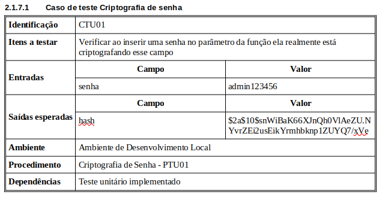
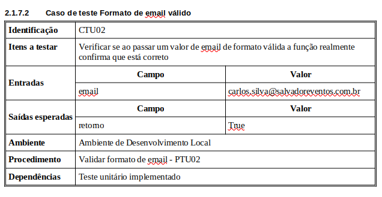
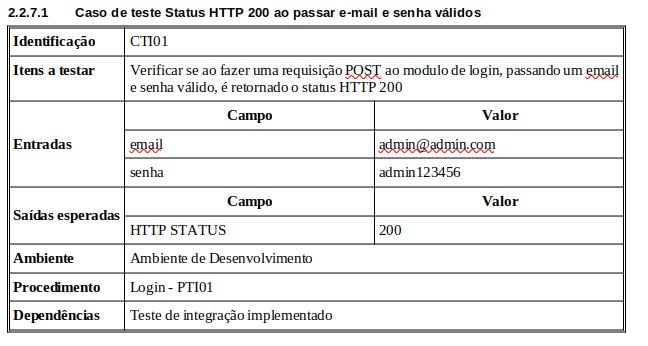
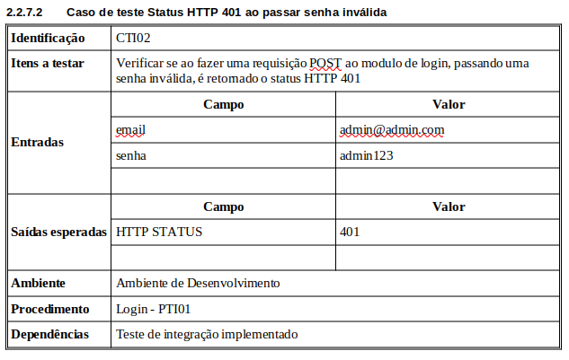
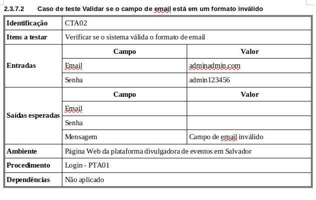
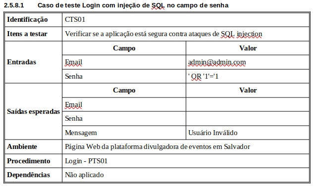

# Implementação dos casos de testes (3ª Entrega da A3 )

Realização dos testes conforme a 3ª Entrega da A3

## Casos de Teste - Unitário

## Casos de Teste - Integração

## Casos de Teste - Aceitação

## Casos de Teste - Regressão

## Casos de Teste - Segurança 

